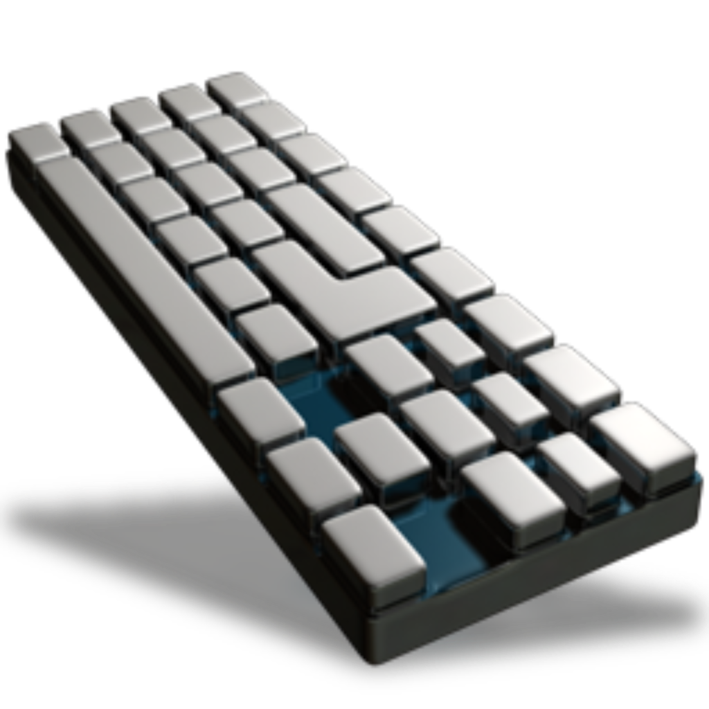

  

<h1 align="center">KeyCount</h1>

  An open source macOS menu bar application that tracks and displays keystroke count and can (optionally) send real-time-like keystroke data to a specified http/https endpoint

  

## Key features
1. Count daily keystrokes and display them in the macOS menu bar
2. Optionally save and view historic daily keystroke values
3. Optionally export keystroke data to an external http/https endpoint in configurable intervals

## To run the app:
1. Install Xcode from Mac App Store
2. Open workspace file: macos-keystroke-counter.xcodeproj
3. Run
4. Grant permissions

## Granting permissions
This application requires your permission to receive events from macOS in order to count and display your keystrokes in the menu bar.

On newer versions of macOS (10.15+) there is an Input Monitoring menu under Security & Privacy within the System Preferences app, and macos-keystroke-counter will appear there automatically the first time you run it. Simply unlock this menu and check the box next to macos-keystroke-counter to enable it.

## Want to contribute?
1. Code away
2. Create a PR
3. We'll merge the PR if all looks good!

_Given the nature of this keystroke counting application, security is paramount. We emphasize the importance of thorough code reviews to ensure the absence of any malicious content or security concerns. Our team is committed to performing rigorous reviews, and we also encourage contributors to uphold the same level of diligence in their code submissions._

## Note on Attribution
This project is open source under the MIT License. If you use or modify this code, kindly attribute it to [macos-keystroke-counter](https://github.com/MarcusDelvecchio/macos-keystroke-counter) and provide a link back to this repository.
